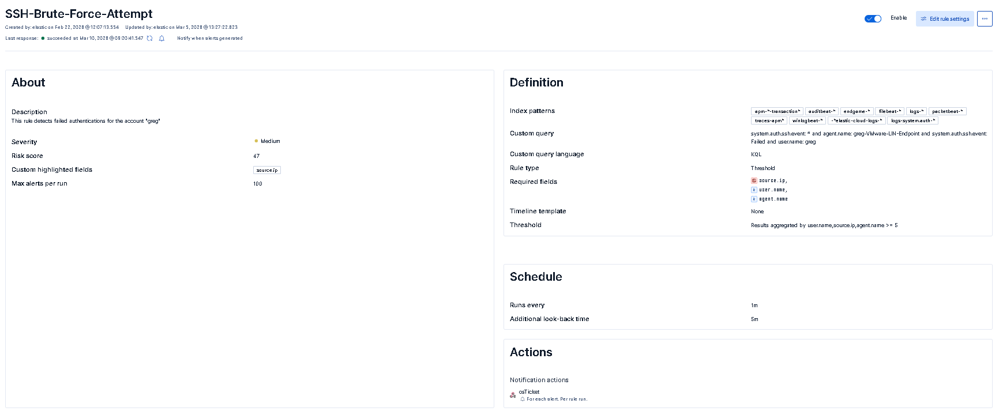

---

## **SSH Brute Force Detection**

This detection rule identifies repeated failed SSH authentication attempts against a Linux server. SSH brute-force attacks occur when an attacker repeatedly attempts to guess valid credentials in order to gain remote access to a system.

In the lab environment, this behavior is simulated using a Kali Linux attacker system running password guessing tools against the monitored Linux endpoint.

The rule, listed above.
---

## **Detection Logic**

The rule monitors Linux authentication logs for multiple failed login attempts within a short time window. When the number of failed authentication events exceeds a predefined threshold, the rule generates a security alert.

This detection focuses on identifying abnormal authentication patterns rather than individual failed logins, since a single failed login is common and typically not malicious.

---

## **Relevant Log Source**

The detection relies on Linux authentication logs collected from the endpoint system. These logs include SSH login attempts, authentication failures, and information about the source IP address initiating the connection.

These logs are forwarded to Elasticsearch through the Elastic Agent installed on the Linux server.

---

## **Alert Context**

When the rule triggers, the alert provides key investigation details including:

- Source IP address initiating the attack
- Target host receiving the login attempts
- Username being targeted
- Number of failed authentication events

This information allows analysts to quickly identify the source of the attack and determine whether the activity represents a real intrusion attempt.

---

## **Purpose in the Lab**

This detection demonstrates how authentication telemetry can be used to identify brute-force attacks against Linux systems.

It also provides a realistic SOC investigation scenario where analysts must determine whether repeated login failures represent malicious activity or normal user error.
