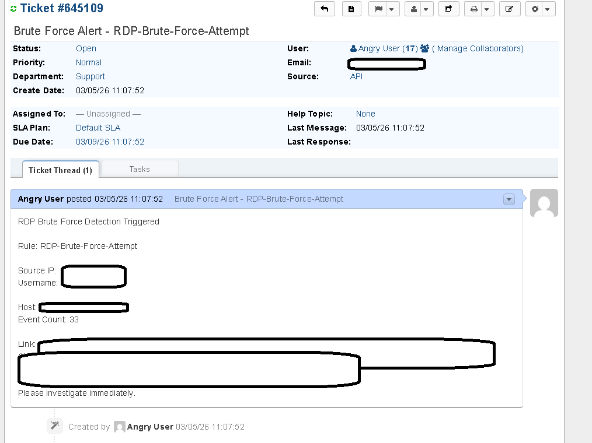

# osTicket Integration

To simulate a realistic Security Operations Center (SOC) workflow, the SOC Detection Lab integrates the Elastic Security platform with an open-source ticketing system.

The ticketing system used in this environment is **osTicket**, which allows security alerts to automatically generate incident tickets when detection rules trigger.

This integration demonstrates how security alerts transition from monitoring systems into a structured incident response workflow.



---

# Purpose of Ticketing in a SOC

In a real security operations environment, alerts generated by a SIEM must be tracked and investigated through a ticketing platform.

Ticketing systems provide several benefits:

- structured incident tracking
- assignment of investigation tasks
- documentation of remediation steps
- historical records of security events

Without a ticketing workflow, security alerts may be missed or improperly handled.

---

# osTicket Deployment

In this lab environment, osTicket was deployed on a dedicated **Windows Server virtual machine** within the virtual network.

The server hosts the osTicket web interface and API endpoint used to create tickets automatically.

The osTicket instance provides the following capabilities:

- incident ticket creation
- ticket tracking
- incident documentation
- SOC workflow simulation

---

# Elastic Security Integration

Elastic Security detection rules were configured to send alerts to osTicket using a **webhook action**.

When a detection rule triggers, the webhook sends an HTTP POST request to the osTicket API.

The API then creates a new ticket containing details about the alert.

The ticket includes contextual information such as:

- detection rule name
- source IP address
- targeted username
- affected host
- number of events that triggered the alert
- a link to the alert in Kibana

---

# Example Ticket Payload

The webhook sends an XML formatted request to the osTicket API.

Example payload:

```xml
<ticket alert="true" autorespond="true" source="API">
  <name>Elastic</name>
  <email>api@osticket.com</email>
  <subject>Security Alert - Detection Rule Triggered</subject>
  <message type="text/plain">
    Security alert generated by Elastic Security.

    Rule: SSH-Brute-Force-Attempt
    Source IP: <ATTACKER_IP>
    Username: <TARGET_USERNAME>
    Host: <AFFECTED_HOST>
  </message>
</ticket>
```

This payload creates a new ticket within osTicket containing the alert details.

---

# Benefits of This Integration

Integrating Elastic Security with osTicket provides a realistic example of how security alerts are managed in operational environments.

The integration demonstrates:

- automated incident creation
- structured alert tracking
- SOC workflow automation
- alert-to-ticket escalation

This component of the lab highlights how detection engineering integrates with incident response processes.
