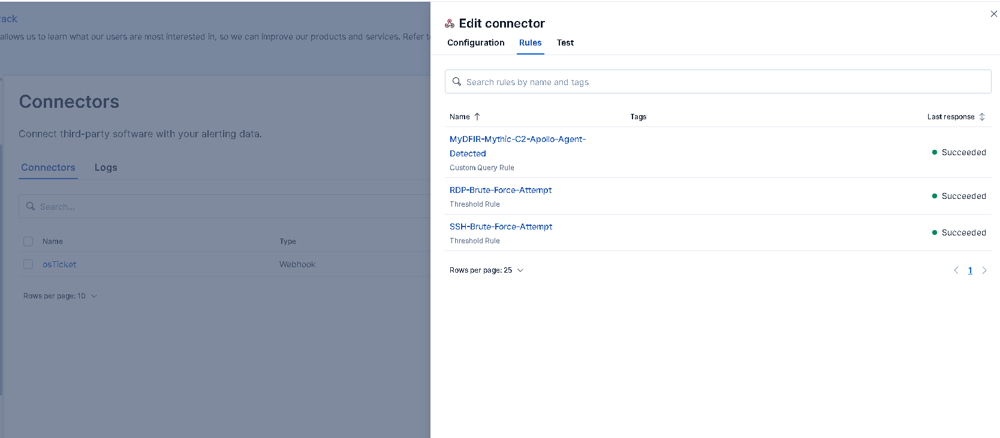

# Webhook Configuration

Elastic Security allows detection rules to trigger automated actions when alerts are generated.

One of the most useful actions is the **webhook connector**, which allows alerts to be forwarded to external systems.

In the SOC Detection Lab, the webhook connector is used to send alerts directly to the osTicket API.

---

# Webhook Connector Overview

The webhook connector enables Elastic to send HTTP requests to external services.

These requests can contain structured alert information such as:

- rule name
- severity
- source IP
- affected host
- user account
- alert metadata

The receiving system can then process the request and take automated action.


---

# Connector Configuration

The webhook connector was configured inside Kibana under:

```
Stack Management → Connectors
```

The connector sends HTTP POST requests to the osTicket API endpoint.

Example configuration:

```
URL: http://<OSTICKET_SERVER>/osticket/api/tickets.xml
Method: POST
```

The request includes an API key used to authenticate with the osTicket server.

---

# Authentication

The osTicket API requires an API key for authentication.

This key is included in the HTTP headers of the webhook request.

Example header:

```
X-API-Key: <API_KEY>
```

This ensures that only authorized systems can create tickets through the API.

---


# Webhook Payload Example

In this lab environment, Elastic Security detection rules use a webhook action to automatically send alert information to the osTicket API.

When a detection rule triggers, Elastic sends an HTTP POST request containing an XML payload with details about the alert.

The payload includes contextual information such as the detection rule name, source IP address, targeted username, affected host, and the number of events that triggered the alert.

The following XML payload is an example used by the SSH brute-force detection rule.

```xml
<?xml version="1.0" encoding="UTF-8"?>
<ticket alert="true" autorespond="true" source="API">
  <name>Elastic</name>
  <email>api@osticket.com</email>
  <subject>Brute Force Alert - {{rule.name}}</subject>
  <phone></phone>
  <message type="text/plain"><![CDATA[
 SSH Brute Force Detection Triggered

Rule: {{rule.name}}

Source IP: {{context.alerts.0.source.ip}}
Username: {{context.alerts.0.user.name}}

Host: {{context.alerts.0.agent.name}}
Event Count: {{context.alerts.0.kibana.alert.threshold_result.count}}

Link: {{rule.url}}

Please investigate immediately.
]]></message>
</ticket>
```

---

# Dynamic Alert Variables

The webhook payload uses Elastic alert variables to automatically insert information from the triggered alert.

These variables allow the ticket to contain contextual investigation data without requiring manual input.

Examples include:

```
{{rule.name}}
{{context.alerts.0.source.ip}}
{{context.alerts.0.user.name}}
{{context.alerts.0.agent.name}}
{{context.alerts.0.kibana.alert.threshold_result.count}}
{{rule.url}}
```

When the detection rule fires, Elastic replaces these placeholders with the actual values from the alert.

For example:

```
Rule: SSH-Brute-Force-Attempt
Source IP: <ATTACKER_IP>
Username: <TARGET_USERNAME>
Host: <AFFECTED_HOST>
Event Count: <FAILED_LOGIN_COUNT>
```

---

# Ticket Creation Process

Once the webhook request is sent, the osTicket API processes the XML payload and creates a new incident ticket.

The ticket includes:

- detection rule name
- source IP address
- targeted username
- affected host
- number of detected events
- a link to the corresponding alert in Kibana

This allows SOC analysts to quickly begin investigating the security alert.

---

# Why This Matters

Automating ticket creation ensures that alerts generated by detection rules are properly tracked and investigated.

Without automation, analysts would need to manually create tickets for every alert, which increases response time and introduces the risk of missed incidents.

This integration demonstrates how security monitoring platforms and ticketing systems work together to support real-world SOC workflows.

---
